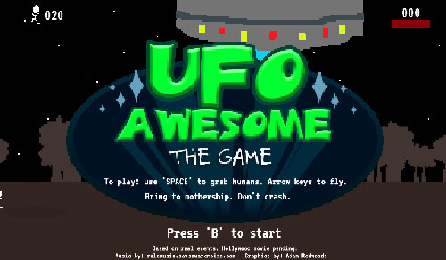
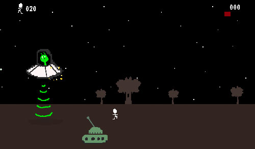
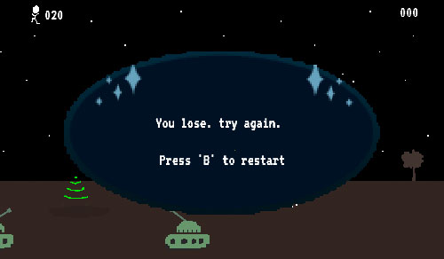

## Technical Requirements
* Display a game in the browser
* Switch turns between two players, or switch turns between a player and the computer (AI)*
* Design logic for winning & visually display which player won
* Include separate HTML / CSS / JavaScript files
* Stick with KISS (Keep It Simple Stupid) and DRY (Don't Repeat Yourself) principles
* Use Javascript or jQuery for DOM manipulation
* Deploy your game online, where the rest of the world can access it
* Use semantic markup for HTML and CSS (adhere to best practices)

## Pictures / Stage Progress  

## Plan of Action
* Think about game logic
	* Win condition, objectives
* Simple graphics, but with animation
* Keep as much as possible dynamic
	* Number of terrain tiles dynamic
	* Terrian size dynamic
* Get player controls just right
* Get terrain scrolling, humans roaming
* Get human pickup working
* Get tanks working
	* Bullet physics
* Get screens working
* Get sounds working

## Libraries used  

* CreateJS Suite (EaselJS, TweenJS, PreloadJS, SoundJS)
* RequireJS

## Assets Used
* Pixsel: Sprite maker
* Jfxr: simple sound effects maker
* Audacity audio editor
* Chip music from: rolemusic.sawsquarenoise.com
* Bitmap fonts

## What Was Difficult
* Adjusting player controls for specific feedback
* Keeping focus on Minimum Viable Product
* Aligning UI screens
* Tank aiming and shooting at UFO, trigonometry
* Collisions
* Tank bullet physics

## What I Liked
* Amusing myself with animations
* Simplicity of graphics
* Using RequireJS to structure project, modular

## Oustanding Issues
* Needs mobile

## Future Ideas
* Mobile, use virtual joystick
* Physics library (P2.js)
* More enemies
* varied levels
